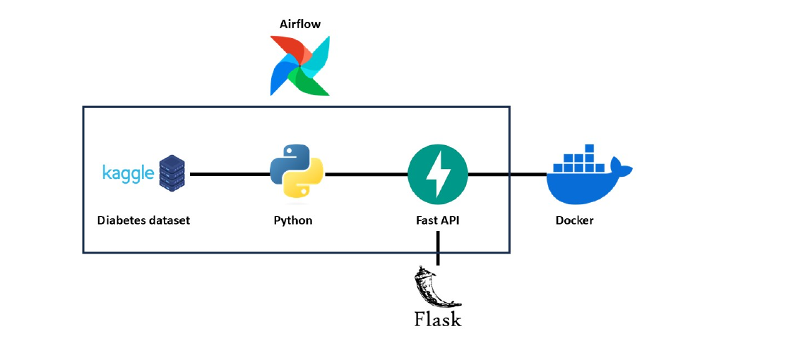

# Setting up a continuous training pipeline using Apache Airflow, FastAPI, Flask, and Docker

This project demonstrates the setup of a continuous training pipeline for machine learning models using Apache Airflow, FastAPI, Flask, and Docker. The project operates on a tabular dataset [Diabetes Data Set](https://www.kaggle.com/datasets/mathchi/diabetes-data-set) from Kaggle.




## Installations

Use the folder of the docker given in the repository above:

```bash
docker compose up -d
```
Once you run the compose, you'll find the container in your docker desktop.

Some of the packages you'll need to install are :

```bash
pip install scikit-learn
pip install pycaret
pip install xgboost
```


## Getting Started

Clone the repository:

    ```bash
    git clone https://github.com/OUSSAMAOUHA/Implementation-of-a-continuous-training-pipeline-using-Apache-Airflow-and-Streamlit.git
    cd projetDiabetes
    ```
    once you're there, you can see the project structure perfectly.
   
2. Check the documetation in the pdf file:

